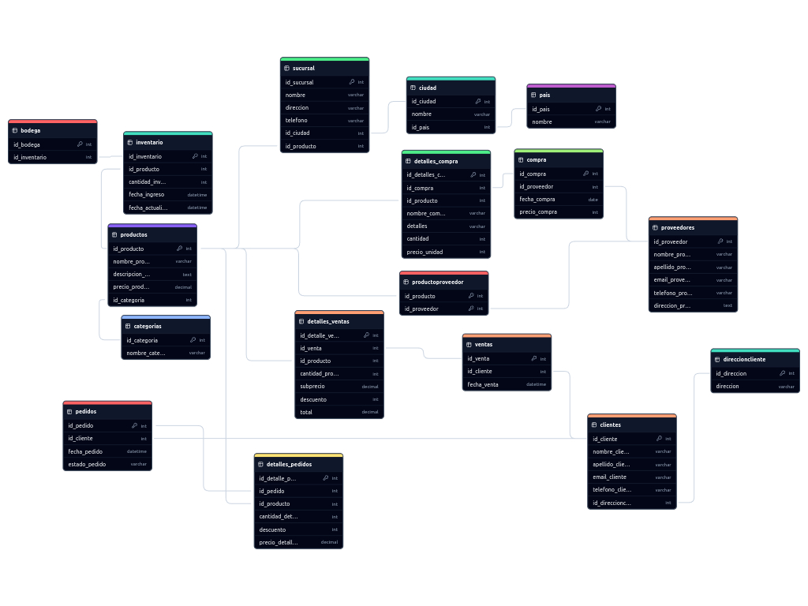

# Proyecto #1

## Desarrollo de un Sistema Integral de Gestión de Ventas para Suministros Eléctricos

Este proyecto tiene como objetivo principal el desarrollo de un sistema de gestión de ventas que satisfaga las necesidades operativas de una empresa dedicada a la comercialización de suministros eléctricos. El sistema está diseñado para ser una solución integral, abarcando desde la gestión de inventario hasta la atención personalizada a clientes, tanto de pequeñas y medianas empresas (PyMEs) como de personas naturales. La implementación de este sistema permitirá optimizar los procesos de venta, mejorar la eficiencia operativa y asegurar la satisfacción del cliente, todo ello respetando los principios de desarrollo de software SOLID, que garantizan la escalabilidad, mantenibilidad y flexibilidad del sistema.

### **Arquitectura del Sistema:**

1. #### **Arquitectura Hexagonal:**

- **Core (Núcleo):** Contendrá las reglas de negocio y modelos de dominio.

- **Adapters (Adaptadores):** Interfaces para la entrada/salida de datos (por ejemplo, controladores web, acceso a la base de datos).

- **Ports (Puertos):** Interfaces que definen cómo los adaptadores interactúan con el núcleo.

  

1. #### **Arquitectura MVC:**

- **Modelo:** Gestión de la lógica de negocio y acceso a los datos.
- **Vista:** Interfaces de usuario que interactúan con el modelo.
- **Controlador:** Maneja las solicitudes del usuario y coordina el modelo y la vista para producir una salida.

### **Objetivos Específicos:**

1. #### **Optimización de la Gestión de Inventario:**

- Implementar un módulo avanzado de gestión de inventario que permita el control en tiempo real de las existencias de productos, la clasificación por categorías, y la generación automática de alertas para el reabastecimiento de productos críticos.

- Facilitar la trazabilidad de los productos, desde su ingreso al almacén hasta su entrega al cliente final, asegurando la integridad y exactitud de la información en todo momento.

  

1. #### **Automatización de las Órdenes de Compra:**

- Desarrollar un sistema que permita la generación ágil y eficiente de órdenes de compra, con funcionalidades que cubran desde la solicitud inicial hasta la aprobación y recepción de los productos.

- Incluir opciones para la gestión de devoluciones, modificaciones de órdenes, y cancelaciones, todo ello integrado con el módulo de inventario para reflejar los cambios en tiempo real.

  

1. #### **Gestión Avanzada de Clientes:**

- Crear una base de datos integral que almacene información detallada de los clientes, incluyendo historial de compras, preferencias, y datos de contacto, permitiendo segmentaciones y análisis personalizados.

- Incorporar herramientas para la gestión de relaciones con los clientes (CRM), que faciliten el seguimiento de interacciones, la personalización de ofertas, y la planificación de estrategias de marketing dirigidas.

  

1. #### **Control y Análisis de Ventas:**

- Diseñar un módulo que permita la administración completa del proceso de ventas, desde la emisión de facturas hasta la aplicación de descuentos y la gestión de diferentes métodos de pago.
- Proporcionar capacidades avanzadas de reportes y análisis, permitiendo la generación de informes personalizados que faciliten la toma de decisiones estratégicas, basadas en datos precisos y actualizados.

## Resultado esperado

- **Gestión de Inventario:** Permitir la adición, edición, eliminación y consulta de productos en el inventario.
- **Gestión de Clientes:** Registrar y gestionar la información de clientes, tanto empresariales como individuales.
- **Gestión de Ventas:** Procesar y registrar ventas, generando facturas y manteniendo un historial de transacciones.
- **Gestión de Pedidos:** Administrar pedidos pendientes, con la capacidad de actualizarlos conforme se cumplan.
- **Reportes:** Generar reportes sobre ventas, clientes y productos, que permitan una mejor toma de decisiones.
